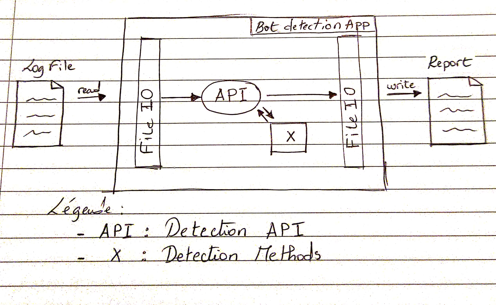
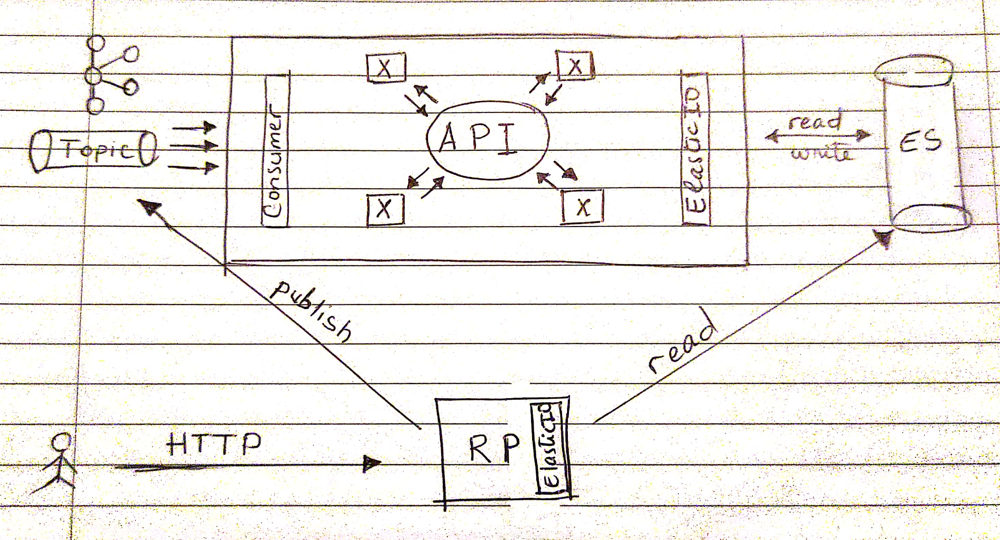

# Bot Detection
Ce projet constitue mon rendu pour le challenge de Datadome.

L'appli se présente comme un agent permetant de détecter à partir de logs un Bot se cache.

## Méthodes utilisé:

Il existe 4 méthodes développé dans l'app qui permettent de décter si un bot se cache derrière les logs:

<ul>
  <li>Calculer la durée moyenne entre les appels à partir de la date des logs</li>
  <li>Détecter s'il existe des appelles en parrallèle: en calculant le nombre d'appels éxecutés dans un lapse de X seconds</li>
  <li>Détecter si on appelle la même la page successivement</li>
  <li>Analyser le user-agent des logs et voir si il est suspect</li>
</ul>

À la fin de ces traitements et en se basant sur ses paramètres on calcule un score en % avec la régle suivante: Pour chaque méthode retournant une détection on applique 1 sinon 0.

Ensuite on divise par 4.

## Architecture de l'APP:

L'architecture hexagonal a été appliqué pour cette app : 
<ul>
  <li>Une API au centre de l'appli pour dévolopper les différentes fonctionnalités</li>
  <li>Des modules qui gravitent autour pour exécuter différente tâche ex: FileIO pour les I/O fichier, X: un modules avec les méthodes cité au-dessus</li>
</ul>

L'archi hexagonale a plusieurs avantages :

<ul>
  <li>Permettre à une application d'être développée et testée en isolation de ses couches d’infrastructure.</li>
  <li>Le code métier est isolé. Il est donc plus facile d’intervenir sur du métier sans impacter les interfaces ou les briques infra</li>
    <li>La mise en place de tests automatisés est plus simple</li>
</ul>

## Techno:

- Scala fonctionnelle 2.13
- fs2: Pour streamer les entrés, l'avantage de cette librairie c'est sa compatibilité avec Cats-effect

## Limitattions:

Cet appli est loin d'être parfaite les limitations constatée :
<ul>
<li>Les Streams ne sont pas de vrai Streams car tous les logs sont chargés en RAM et analysés</li>
<li>La première méthode de detection nécessite une formule de la data science pour évaluer une vrai moyenne</li>
</ul>

## Scale it!:

Pour mettre en place une solution plus robuste pouvant supporter plus de charge, des outils **Big Data** existent pour faciliter la tâche.

Ainsi au lieu d'avoir une appli qui analyse les logs, on peut séparer la tâche en 2 services différents :

- **RP**: une appli sous forme d'un reverse proxy par où transitent tous les appels Http. Cette dernière se base sur des données déjà analysé par un module et posé sur un Elastic.
- **API**: une appli ou outil (Spark/Flink/) lit d'un topic tous les logs, en suivant des règles met à disposition du RP les analyses. Le multithreading peut être envisagé ici pour accélérer les analyses

L'avantage est que cette architecture est Scalable,  si un Rancher/Kubernetes est mis en place pour orchestrer nos différents composants:
- Scaling: ajout de pods/noeuds
- Redémarrage
- Communication entre composant
- Décentralisation :prévenir les coupures de courant, dégâts matériel
- isolation de chaque composant: Fuite mémoire

## Launch it!:

Lancer l'appli sur un IDE aller dans DetectionConnector.scala le main de l'appli.
Un exemple a été developpé avec des paramètres définie et sous forme un Stream.repeatN times avec le même log.

Un autre test plus complexe existe dans les tests d'intégrations.

Ainsi que les TU testant les différentes méthodes.

